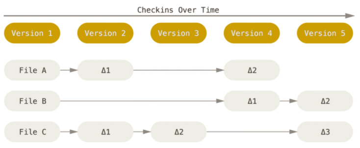
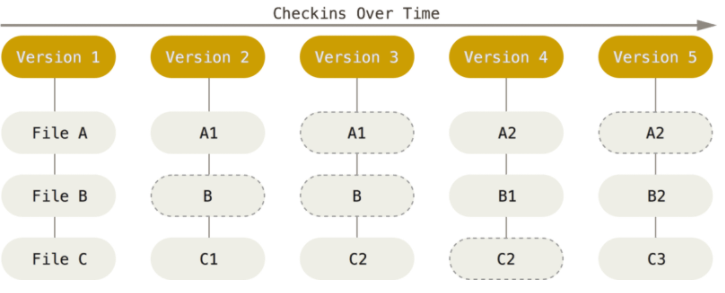

[toc]
## 待整理
* `git hash-object -w filepath` 将filepath下的文件生成一个快照,并将这个快照通过特定算法生成一个对应40位hashcode,以hashcode前两位作为文件夹名称,后38位作为快照的文件名保存在文件夹下面.
* `find .git/object  -type  f` 这个命令可以查看git下所有的快照文件的存储位置
* `git cat-file -p hashCode`查看hashcode对应的文件的内容
* `git cat-file -t hashCode` 查看hashcode对应的文件的类型
* .git/object下存储的文件的类型有哪些
	* `blob object` 数据对象,保存每个文件的各个版本的快照
	* `tree object` 包含多个blob或tree的树形结构
	* `commit object` 提交信息,包含被作为提交版本的tree,提交人信息,以及提交注释
* `git cat-file -p master` 查看master分支的最新的提交信息
* `git cat-file -p master^{tree}` 查看master分支的tree中包含的内容
* `git update-index --add --cacheinfo 100644 hashCode` 
* git diff 比较工作区和暂存区文件的差异(untracked 文件不会显示)
* git diff HEAD 比较工作区与当前分支最后一次提交后的文件的差异
* git diff --cached 比较暂存区和当前分支最后一次提交后的文件的差异
* 

## git原理
### git的目录结构


### git的逻辑区域划分


### git的命令
### git基础知识
### git 和svn的区别
1. 版本控制的区别:
	* svn:集中化的版本控制系统,有一个统一管理的服务器,保存所有文件的修订版本.
		* 缺点:必须联网才可以,如果中央服务器宕机,就无法提交更新.如果中心数据库磁盘损坏,会丢失所有数据,包括整个变更历史.
	* git:分布式的版本控制系统.每个用户都有仓库的完整镜像.任何一个服务器发生故障,可以从任意一个本地仓库中恢复完整数据.
2. 保存文件信息的差别
	 * svn:每个文件的信息是通过 保存一个基本文件和文件随时间逐步累积的差异,存储每个文件与初始版本的差异.
		
	 * git:直接记录文件快照,而非差异的比较.保存时会对全部文件制作一个快照并保存这个快照的索引.
		
		
### git三个工作区
1. 工作区(working directory)
2. 暂存区(staging area)
3. git仓库(repository)

### git中文件的状态
使用`git status`或者`git status -s`或者`git status --short`查看当前文件的状态   
1. untracked:还未加入版本库,使用 `git add`加入暂存区,变为staged
2. staged:已暂存,使用`git commit`提交本地仓库,变为commited
3. unmodified(commited):已提交,在工作区修改已提交的代码,变成modified
4. modified:使用`git add`加入暂存区,变为staged


### git命令大全
|命令|作用|说明|
|--|--|--|
|`git status`|状态简览|命令的输出十分详细,但其用语有些繁琐.如果你使用`git status -s`命令或`git status --short`命令,将得到一种更为紧凑的格式输出|
|`git diff`|查看文件具体的修改情况|只会显示被跟踪的文件,且没有放入暂存区的修改|
|`git diff --cached`|查看暂存区中文件的修改情况|只会显示已经加入暂存区中的修改|
|`git commit -a`|提交所有被跟踪文件的修改|加上 -a 选项,Git 就会自动把所有已经跟踪过的文件暂存起来一并提交,从而跳过 git add 步骤|
|`git rm test.txt`|删除文件|下次提交就会将该文件从仓库中删除.如果该文件已经被放入暂存区,则报错,需要使用下面的命令|
|`git rm -f test.txt`|强制删除文件|会将暂存区中保留的该文件的信息一并删除,下次提交就会将该文件从仓库中删除|
|`git rm -cache test.txt`|删除文件在仓库中的信息,但本地文件会保留|相当于是文件变成untracked状态|
|`git mv a.txt b.txt`|移动文件/重命名文件|相当于三个操作,`mv a.txt b.txt`;`git rm a.txt`;`git add b.txt`|
|`git log [-p]  [-num]`|查看提交日志|`-p`显示每次提交的内容差异. `-num`需要显示最近几次提交|
|`git log --stat`|列出每次提交文件的修改情况||
|`git log --pretty=[oneline|full|fuller|format:"%h - %an, %ar : %s"]`|指定显示提交记录的格式|`oneline`只显示每次提交的说明;`full`额外显示作者和提交人;`fuller`额外显示时间;`format:"%h - %an, %ar : %s"`指定显示格式,其中可用的参数有`%h`快照的hash值,`%an`作者,`%ar`距离现在已经过去多长时间,`%s`每次提交的说明|
|`git commit --amend`|重新提交|本次提交会代替上一次提交的结果,最终日志中只有本次提交的记录.|
|`git checkout -- a.txt`|撤销本次对a.txt的修改|会从仓库中拉取最新的a.txt覆盖本地文件|
|`git remote [-v]`|查看远程仓库|显示远程仓库名,`-v`显示需要读写远程仓库使用的 Git 保存的简写与其对应的 URL|


## git的常用操作
### 设置用户名和邮箱
```
git config [--global] user.name "xxx"
git config [--global] user.email "xxx@xx.com"
```
### 如何将本地仓库关联远程仓库并上传第一份代码 
1. 初始化本地仓库: git init 
2. 将本地代码添加到暂存区 : git add --all
3. 将本地代码添加到本地仓库: git  commit -m"init"
4. 关联远程仓库: git  remote  add  origin  https://xxxx.git
5.  将远程仓库代码拉下来,合并到本地代码: git pull origin master  --allow-unrelated-histories
6. 设定本地分支关联的远程分支: git branch  --set-upstream-to=origin/master   master
5. 将本地代码上传到远程仓库: git push
